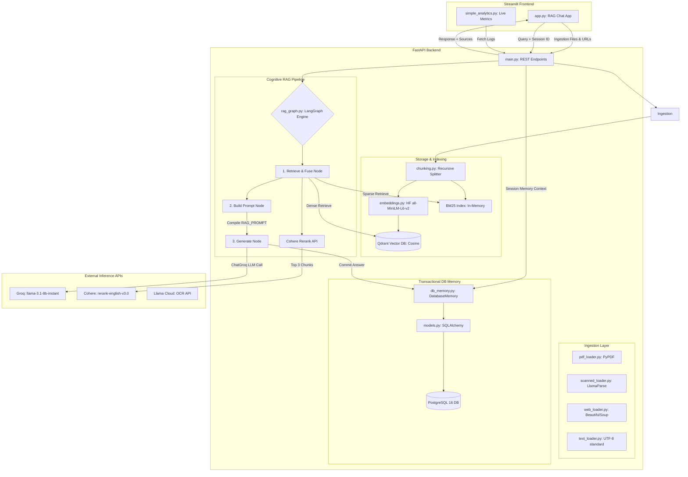

# 📚 Multi-Source RAG Assistant — System Documentation

Welcome to the comprehensive system documentation for the **Multi-Source RAG Assistant**. This document details the architectural layers, data workflows, algorithms, and design choices powering this industry-grade Retrieval-Augmented Generation (RAG) platform.

---

## 📖 Executive Summary

The **Multi-Source RAG Assistant** is a self-contained, enterprise-oriented RAG system designed to ingest heterogeneous documents (standard PDFs, scanned files requiring OCR, raw text, and crawled webpages) and answer questions with high contextual precision. 

By leveraging **LangGraph** to model the cognitive logic as a deterministic state machine, **Qdrant** + **BM25** for hybrid retrieval, **Cohere** for advanced neural reranking, and **PostgreSQL** for transactional chat history, this project avoids common RAG failure modes (hallucinations, lost-in-the-middle context issues, and memory leakages).

---

## 🏗️ High-Level System Architecture

The application is built on a modern decoupled architecture: a sleek **Streamlit** user interface (incorporating custom CSS glassmorphism) talking to a high-throughput **FastAPI** backend over REST.



---

## 📂 Deep Dive: The Ingestion Pipeline

To handle files of varying structural density, the system hosts a specialized modular ingestion layer that standardizes documents into unified `langchain.schema.Document` nodes before chunking.

```mermaid
flowchart LR
    Source([Document Source]) --> Type{File Extension?}
    Type -->|.pdf / digital| Digital[PyPDF Loader]
    Type -->|.pdf / scanned| Scanned[LlamaParse Cloud OCR]
    Type -->|.txt| Text[UTF-8 Text Loader]
    Type -->|http:// / https://| Web[BS4 Web Loader]

    Digital --> Unified[Unified Document Array]
    Scanned --> Unified
    Text --> Unified
    Web --> Unified

    Unified --> Split[Recursive Splitter\nChunk: 500 | Overlap: 50]
    Split --> Clean[Discard Chunks < 10 chars]
    Clean --> Output[Final Tokenizable Chunks]
```

### Ingestion Components Reference

| Component | Loader/Source | Parsing Method | Ideal Use Case |
| :--- | :--- | :--- | :--- |
| **Standard PDF Loader** | `PyPDFLoader` | Fast, local text extraction | Reports, research papers, digital e-books. |
| **Scanned PDF (OCR)** | `LlamaParse` | Cloud-based AI table/markdown OCR parsing | Scanned receipts, photographed documents, heavy grid-tabular documents. |
| **Text Loader** | `TextLoader` | Direct system input/file stream with UTF-8 support | Log files, simple readmes, plain scripts. |
| **Web URL Loader** | `WebBaseLoader` | HTML scraping with metadata header capture | Wiki articles, blog posts, online documentation. |

---

## 🔍 Deep Dive: Advanced Retrieval & Fusion Pipeline

A common limitation of vector databases is their inability to capture exact keyword matches (e.g., serial numbers, specific code terms). This platform circumvents this via **Hybrid Search Fusion** coupled with **Neural Reranking**.

```
              ┌────────────────────────────────────────┐
              │             USER QUESTION              │
              └───────────────────┬────────────────────┘
                                  │
                 ┌────────────────┴────────────────┐
                 ▼                                 ▼
     ┌───────────────────────┐         ┌───────────────────────┐
     │ DENSE SEMANTIC SEARCH │         │  SPARSE KEYWORD MATCH │
     │  (Qdrant Vector DB)   │         │    (BM25 Retriever)   │
     │      Weight: 0.6      │         │      Weight: 0.4      │
     └───────────┬───────────┘         └───────────┬───────────┘
                 │                                 │
                 └────────────────┬────────────────┘
                                  │
                                  ▼
                     ┌───────────────────────────┐
                     │   ENSEMBLE FUSION MATCH   │
                     │    (Candidate List K=10)  │
                     └────────────┬──────────────┘
                                  │
                                  ▼
                     ┌───────────────────────────┐
                     │ COHERE NEURAL RERANKER    │
                     │  (Model: rerank-v3.0)     │
                     └────────────┬──────────────┘
                                  │
                                  ▼
                     ┌───────────────────────────┐
                     │    TOP 3 CONTEXT CHUNKS   │
                     │    (Fed to prompt Node)   │
                     └───────────────────────────┘
```

1. **Embedding Generation:** 384-dimensional dense vectors generated via `all-MiniLM-L6-v2`.
2. **Dense Vector Retrieval:** Semantic queries calculated using **Cosine Similarity** on Qdrant.
3. **Sparse Sparse Retrieval:** Lexical queries processed in parallel via the **BM25 algorithm**.
4. **Reciprocal Fusion/Ensemble:** Combined using `EnsembleRetriever` with a **60% Dense / 40% Sparse** split to build a candidate list ($K=10$).
5. **Neural Reranking:** Passed to the Cohere Neural Reranker to filter out high-distance matches and sort the top **3** chunks in descending order of true query relevance.

---

## 🧠 Deep Dive: Cognitive State Machine (LangGraph)

The query engine is driven by a deterministic state-machine compile, defining an immutable state schema throughout the lifecycle of a query.

### The RAGState Schema
```python
class RAGState(TypedDict):
    query: str         # The user's input question
    context: str       # Consolidated context chunks retrieved and reranked
    chat_history: str  # Contextual history loaded from PostgreSQL
    prompt: str        # Compiled system-prompt string
    answer: str        # Final text output produced by the LLM
```

### Graph Execution Mechanics
* **Node 1: `retrieve`**  
  Invokes the hybrid search index, feeds candidates to `rerank_results()`, and builds the markdown contextual blocks formatted with clear metadata headers:
  ```markdown
  [Source: filename.pdf]
  Relevant chunk text content...
  ```
* **Node 2: `prompt`**  
  Ingests `context`, `chat_history`, and the `query` to format the core operational instructions (`RAG_PROMPT`).
* **Node 3: `generate`**  
  Invokes `ChatGroq` using the optimized `llama-3.1-8b-instant` engine. The resultant answer is committed to the state dictionary and simultaneously logged back into the PostgreSQL memory database.

---

## 💾 Storage & Conversational Memory Layer

Rather than losing system memory upon API container restarts, conversation sessions are written transactionally to a **PostgreSQL 16** database.

### The SQLAlchemy Database Schema
```
  ┌────────────────────────────────────────────────────────┐
  │                     CHAT_MESSAGES                      │
  ├───────────────┬───────────────────────────┬────────────┤
  │ id            │ VARCHAR                   │ PK         │
  │ session_id    │ VARCHAR                   │ INDEXED    │
  │ user_query    │ TEXT                      │            │
  │ ai_answer     │ TEXT                      │            │
  │ created_at    │ TIMESTAMP                 │ UTC        │
  └───────────────┴───────────────────────────┴────────────┘
```

### `DatabaseMemory` Wrapper Flow
1. **`load_memory_variables()`**: Triggered at the beginning of each `/query` request. Queries PostgreSQL for records matching `session_id`, orders them chronologically by `created_at`, and constructs a unified history block:
   ```
   Human: What are the main revenue numbers?
   AI: Based on page 4, the revenue was $1.2M.
   
   Human: Tell me more about the expenses.
   AI: ...
   ```
2. **`save_context()`**: Triggered upon final generation. Inserts a new row with a generated `uuid.uuid4()` token containing the user's prompt and the LLM's response, committing the transaction safely.

---

## 🎨 User Interface & Operational Dashboards

The application is styled with premium, state-of-the-art dark aesthetics, utilizing rich glassmorphism (layered HSL gradients, frosted glass panels, subtle hover animations, and glowing badges).

```
   ┌──────────────────────────────────────────────────────────────────┐
   │ 💬 RAG ASSISTANT UI                                              │
   ├────────────────────────┬─────────────────────────────────────────┤
   │  📂 UPLOAD SOURCES     │      💬 MULTI-SOURCE RAG ASSISTANT      │
   │  ┌──────────────────┐  │                                         │
   │  │   Standard PDF   │  │    🤖 Welcome! Upload files on the      │
   │  │   [Drag & Drop]  │  │       left sidebar to start querying    │
   │  └──────────────────┘  │                                         │
   │  ┌──────────────────┐  │    👤 Human: Explain page 3 formulas?   │
   │  │ Scanned PDF OCR  │  │                                         │
   │  │   [LlamaParse]   │  │    🤖 AI: Formula (1.2) represents...   │
   │  └──────────────────┘  │       ┌──────────────────────────────┐  │
   │  ┌──────────────────┐  │       │ 📚 Sources:                  │  │
   │  │    Text File     │  │       │ • financial_report.pdf       │  │
   │  └──────────────────┘  │       └──────────────────────────────┘  │
   │  ┌──────────────────┐  │                                         │
   │  │     Web URL      │  │                                         │
   │  │ [https://...]    │  │                                         │
   │  └──────────────────┘  │                                         │
   │                        ├─────────────────────────────────────────┤
   │  🔄 Session Actions    │  [ Ask anything about your sources...]  │
   └────────────────────────┴─────────────────────────────────────────┘
```

### Frontend Breakdown
* **`app.py`:** Includes modular drag-and-drop file uploaders, session resetters (`Clear History` / `New Session`), auto-collapsing expandable tables for retrieved resource names, and dynamic chat bubbles loaded from Streamlit session states.
* **`simple_analytics.py`:** Generates high-end metrics cards highlighting key telemetry (e.g., total active queries, average database latency, and system error rates) built with glowing status dots.

---

## 📈 Future System Roadmap

To scale this system into a multi-tenant enterprise system, consider the following roadmap items:
1. **Persistent Vector Database Store:** Migrate from memory-based Qdrant (`:memory:`) to containerized Qdrant storage mapped to local disk partitions, preserving embeddings across server restarts.
2. **Distributed Ingestion Workers:** Offload LlamaParse OCR tasks and heavy PDF ingestion to asynchronous task queues (**Celery + Redis**) to prevent long-running file uploads from blocking FastAPI's ASGI event loop.
3. **Advanced Semantic Chunking:** Implement dynamic chunking boundaries using embedding distance layout differences (sentence-level breaks) instead of static character limits.
4. **Graph-Driven Self-Correction:** Add feedback loops to the LangGraph flow:
   ```
   Retrieve -> Generate -> Evaluate Answer Quality -> [Fail: Query Rewriter/Re-retrieve] -> [Pass: Return Answer]
   ```
